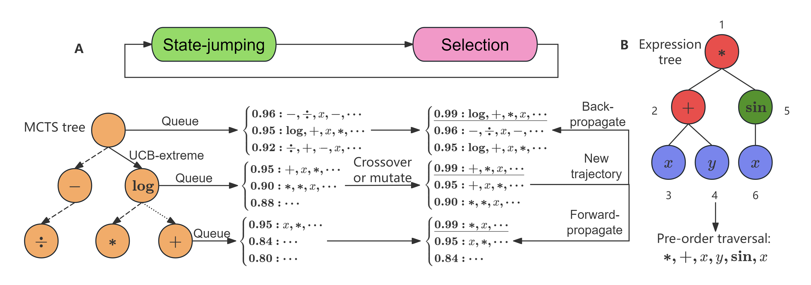

# Improving MCTS for Symbolic Regression

## 1. Project Overview



This repository implements an improved Monte Carlo Tree Search (MCTS) framework tailored for symbolic regression. The primary enhancements to the standard MCTS procedure are:

1. **Extreme Bandit Allocation Strategy** – an adaptive sampling scheme (UCB-extreme) to allocate more simulations to regions with high potential for optimal expressions.  
2. **Evolution‑Inspired State‑Jumping Actions** – incorporating genetic‑programming‑style mutations and crossovers within the MCTS to diversify exploration and accelerate convergence.

The main implementation of the algorithm resides in the `iMCTS` directory.

Key features:

- **Custom Reward Functions**  
  Users may supply arbitrary reward functions, provided that each returns a scalar in the interval \[0, 1\] and accepts three arguments:  
  - `x` (input variable)  
  - `y` (target variable)  
  - `f` (candidate symbolic expression)  

- **Support for Complex Constants**  
  Expressions may include complex‑valued constants. In the symbol set, `R` denotes the real subspace and `C` the complex subspace.

---

## 2. System Requirements

- **Python** ≥ 3.10

To install all required dependencies, execute:

```bash
git clone https://github.com/PKU-CMEGroup/MCTS-4-SR
cd MCTS-4-SR
pip install -e .
```

---

## 3. Repository Contents

| Script                  | Description                                                                                   |
|-------------------------|-----------------------------------------------------------------------------------------------|
| `benchmark_runner.py`   | Runs the MCTS algorithm on a suite of symbolic‑regression benchmarks. Outputs are saved under `results/`. |
| `demo.py`               | Demonstrates a run on the Nguyen-7 benchmark with default settings. You may modify the equation being tested. |

---

## 4. Usage Instructions

### 4.1 Running the Algorithm

Refer to demo.py; you can run the algorithm as follows:

```python
import numpy as np
from iMCTS import Regressor

var_num = 1
X = np.random.uniform(0, 2, (var_num, 20))

def f(x):
    return np.log(x[0] + 1) + np.log(x[0]**2 + 1)

Y = f(X)
model = Regressor(
    x_train=X,
    y_train=Y,
    ops=['+', '-', '*', '/', 'sin', 'cos', 'exp', 'log'],  # If constants are needed, add 'R'
    verbose=True,  # Prints detailed runtime logs
)
sym_exp, vec_exp, evaluations, path = model.fit()
```

The four outputs above correspond to, respectively, the simplified expression, the unsimplified expression, the number of valid equations generated by the algorithm, and the corresponding symbol sequence. Note that in the implementation of the fit method in `iMCTS/regressor.py`, the maximum runtime is limited to 48 hours; you may modify this as needed.

### 4.2 Running Benchmarks

To evaluate performance on the Nguyen benchmark suite, for example, run:

```bash
python benchmark_runner.py --benchmark Nguyen --config ./configs/basic.yaml
```

By default, this command uses 10 parallel processes. You can modify this setting in `./benchmarks/run.py`.

The `--benchmark` option may be set to any of the following:

- `Nguyen`  
- `NguyenC`  
- `Jin`  
- `Livermore`  
- `Blackbox`

> **Important:** Prior to using the `Blackbox` benchmark, download the `datasets/` directory from the [PMLB repository](https://github.com/EpistasisLab/pmlb) and place it in the project root.

Configuration files reside in the `configs/` directory. You may adjust algorithm parameters (e.g. exploration constant, mutation rate, UCB-extreme parameters) by editing the corresponding YAML file.

## 5. Citation

Zhengyao Huang, Daniel Zhengyu Huang, Tiannan Xiao, Dina Ma, Zhenyu Ming, Hao Shi, Yuanhui Wen. "[Improving Monte Carlo Tree Search for Symbolic Regression](https://arxiv.org/abs/2509.15929)."

---