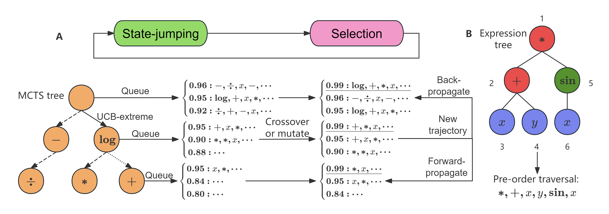

# MCTS-4-SR



*Improving Monte Carlo Tree Search for Symbolic Regression*


MCTS-4-SR is a C++20 implementation of Monte Carlo Tree Search for symbolic regression, with Python bindings exposed through `pybind11`.

The repository includes the C++ search core, the `imcts` Python package, benchmark tooling, and end-to-end tests.

## Highlights

- C++20 symbolic regression engine
- Python package interface via `pybind11`
- CMake build with automatic dependency fetching for Eigen, `pybind11`, and Catch2
- Synthetic and black-box benchmark runners
- Catch2 and Python smoke tests

## Installation

### Python package for development

Use this path if you want `import imcts` in your active Python environment.

```bash
conda create -n imcts python=3.11 -y
conda activate imcts
python -m pip install -U pip
python -m pip install -e .
```

### CMake build

Use this path if you want to build the C++ library, Python extension, and tests directly. Missing third-party dependencies are fetched automatically during configuration.

```bash
cmake -S . -B build -DCMAKE_BUILD_TYPE=Release -DIMCTS_BUILD_PYTHON=ON -DBUILD_TESTING=ON
cmake --build build --config Release
```

On Windows with the Visual Studio generator, a serial build is often more stable:

```bash
cmake --build build --config Release -- /m:1
```

`cmake` builds the extension in `build/`, but it does not install the `imcts` package into your current Python environment. For normal Python imports outside the build tree, use `python -m pip install -e .`.

## Quick Start

Run the bundled demo:

```bash
python python/demo.py
```

Use the Python API directly:

```python
import numpy as np
import imcts

x = np.linspace(0, 2, 100, dtype=np.float32).reshape(1, 100)
y = (np.sin(x[0]) + 0.5 * x[0]).astype(np.float32)

cfg = imcts.RegressorConfig()
cfg.ops = ["+", "-", "*", "/", "sin", "cos", "exp", "log", "R"]
cfg.max_depth = 6
cfg.K = 500
cfg.c = 4.0
cfg.gamma = 0.5
cfg.gp_rate = 0.2
cfg.mutation_rate = 0.1
cfg.exploration_rate = 0.2
cfg.max_unary = 999
cfg.max_constants = 4
cfg.lm_iterations = 100
cfg.max_evals = 100000
cfg.succ_error_tol = 1e-6

model = imcts.Regressor(x, y, cfg)
result = model.fit(seed=42)

print(result.best_reward)
print(result.expression)
print(imcts.simplify_expression(result.expression))
```

You can also use the default configuration from `include/imcts/regressor.hpp`:

```python
model = imcts.Regressor(x, y)
```

`fit()` returns:

- `best_path`
- `best_coefficients`
- `expression`
- `best_reward`
- `n_evals`

## Benchmarks

List bundled benchmark cases:

```bash
python -m imcts.benchmarks --list
```

Run Nguyen benchmarks:

```bash
python -m imcts.benchmarks --group Nguyen
python -m imcts.benchmarks --group Nguyen --workers 8
```

Run a small black-box benchmark sweep:

```bash
python -m imcts.benchmarks --group BlackBox --cases 1-3 --runs 3
```

Use `--workers` to control the number of parallel worker processes for independent seed runs. By default, the benchmark runner uses the physical CPU core count; pass `--workers 1` to disable parallelism.

Black-box benchmarks expect datasets under `datasets/`. The format follows [PMLB](https://github.com/EpistasisLab/pmlb). If a `.tsv.gz` file is only a Git LFS pointer, fetch the real dataset contents before running the benchmark.

Benchmark outputs are written under `benchmark_results/<group>/` by default. You can also set `output.results_dir` in YAML or pass `--results-dir` to separate different experiment configurations.

Summarize benchmark outputs across groups or cases:

```bash
python -m imcts.benchmarks.report
python -m imcts.benchmarks.report nguyen --level case
python -m imcts.benchmarks.report --result_dir path/to/results
```

## Testing

Run all configured CMake tests:

```bash
ctest --test-dir build -C Release --output-on-failure
```

Run the Python smoke tests directly:

```bash
python python/test_imcts.py
```

Run the Python smoke tests with `pytest`:

```bash
python -m pip install -e ".[test]"
python -m pytest
```

## Repository Layout

```text
include/imcts/     C++ headers
source/            C++ implementation
imcts/             Python package and benchmark runner
python/            bindings, demo, and smoke tests
test/              Catch2 tests
assets/            project image and slides
```

## Notes

- Input features are expected in shape `[n_vars, n_samples]`.
- Add `R` to `ops` when learnable constants are required.
- Invalid numerical expressions are penalized during evaluation.

## Citation

If you use this project, please cite:

> Zhengyao Huang, Daniel Zhengyu Huang, Tiannan Xiao, Dina Ma, Zhenyu Ming, Hao Shi, Yuanhui Wen.
> *Improving Monte Carlo Tree Search for Symbolic Regression*.
> https://arxiv.org/abs/2509.15929
