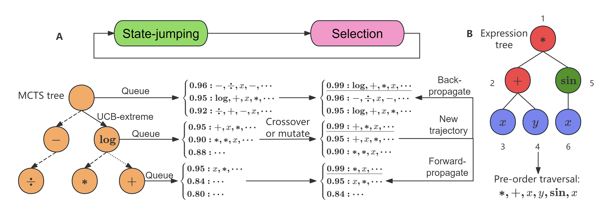
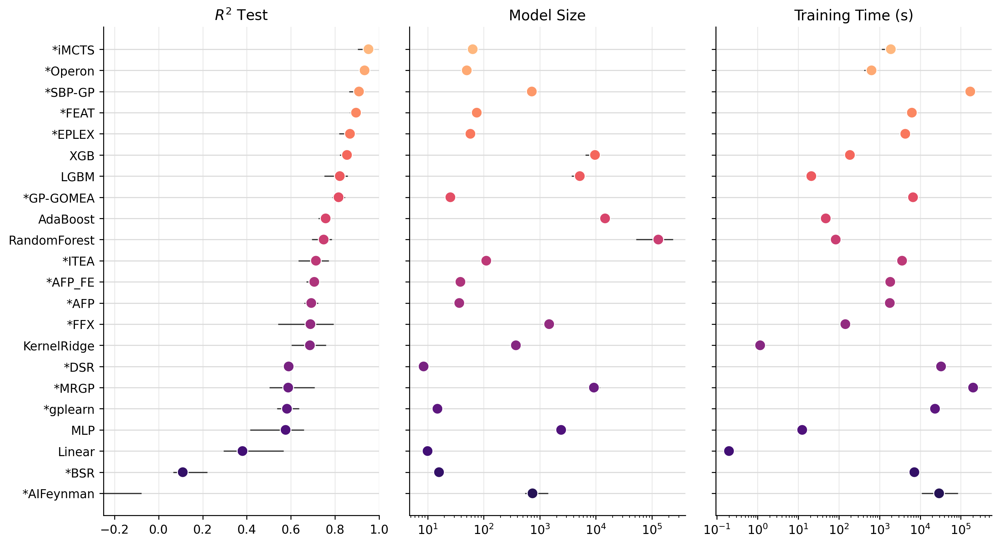
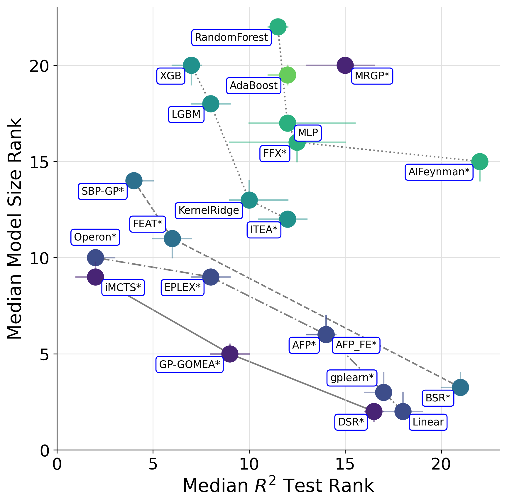

# MCTS-4-SR



*Improving Monte Carlo Tree Search for Symbolic Regression*


MCTS-4-SR is a C++20 implementation of Monte Carlo Tree Search for symbolic regression, with Python bindings exposed through `pybind11`.

The repository includes the C++ search core, the `imcts` Python package, benchmark tooling, and end-to-end tests.

## Highlights

- C++20 symbolic regression engine
- Python package interface via `pybind11`
- CMake build with automatic dependency fetching for Eigen, `pybind11`, and Catch2
- Synthetic and black-box benchmark runners
- Catch2 and Python smoke tests

## Results

All results below are fully reproducible using the benchmark tooling in this repository. Raw outputs (CSV logs and summary tables) are kept under [`benchmark_results/`](benchmark_results/), and all figures can be regenerated with `python -m imcts.benchmarks.plot`.

### Synthetic Benchmarks

iMCTS results on standard symbolic regression benchmark suites. Each run is limited to generating at most 2M expressions, with 100 runs per case.

<div align="center">

| Suite | Cases | Runs | Success Rate | Median R² | Avg Time (s) | Avg Complexity |
|-------|-------|------|-------------|-----------|-------------|----------------|
| **Nguyen** | 12 | 1200 | 93.7% | 1.000 | 1.3 | 9.8 |
| **NguyenC** | 5 | 500 | 100.0% | 1.000 | 1.6 | 10.6 |
| **Livermore** | 22 | 2200 | 72.5% | 1.000 | 4.9 | 12.3 |
| **Jin** | 6 | 600 | 95.2% | 1.000 | 26.0 | 15.2 |

</div>

### BlackBox Benchmark Comparison (SRBench BlackBox)

iMCTS is compared against all 22 SRBench BlackBox algorithms on 122 PMLB datasets. SRBench baseline results are cached in [`benchmark_results/srbench`](benchmark_results/srbench) and are available from [SRBench](https://github.com/cavalab/srbench).

<div align="center"></div>

Pareto rank — accuracy vs. simplicity trade-off. The Pareto plot uses the
median per-dataset rank on each axis; the summary table below reports mean
per-dataset ranks.

<div align="center"></div>

#### Algorithm Ranking (mean $R^2$ rank, lower is better)

<div align="center">

| Rank | Algorithm | Median $R^2$ | Mean $R^2$ Rank | Median Size | Mean Size Rank |
|------|-----------|---------------|-------------------|-------------|-----------------|
| 1 | **iMCTS** | 0.951 | **4.20** | 63.75 | 9.02 |
| 2 | Operon | 0.934 | 5.08 | 50.0 | 9.80 |
| 3 | SBP-GP | 0.908 | 5.98 | 720.8 | 14.39 |
| 4 | XGB | 0.854 | 6.99 | 9641 | 19.34 |
| 5 | FEAT | 0.895 | 7.53 | 75.3 | 9.91 |

</div>

Full results (all 23 algorithms) are in [`assets/imcts_blackbox_summary.csv`](assets/imcts_blackbox_summary.csv).

Additional plots:
- [Accuracy-complexity](assets/blackbox_accuracy_complexity_rank.png) — algorithm-level comparison
- [R² distribution](assets/blackbox_r2_distribution.png) — per-algorithm boxplot
- [R² rank](assets/blackbox_r2_rank.png) — sorted by mean rank

To regenerate the comparison figures:

```bash
python -m imcts.benchmarks.plot
```

To inspect per-case results in detail:

```bash
python -m imcts.benchmarks.report
```

## Installation

### Python package for development

Use this path if you want `import imcts` in your active Python environment.

```bash
conda create -n imcts python=3.11 -y
conda activate imcts
python -m pip install -U pip
python -m pip install -e .
```

### CMake build

Use this path if you want to build the C++ library, Python extension, and tests directly. Missing third-party dependencies are fetched automatically during configuration.

```bash
cmake -S . -B build -DCMAKE_BUILD_TYPE=Release -DIMCTS_BUILD_PYTHON=ON -DBUILD_TESTING=ON
cmake --build build --config Release
```

`cmake` builds the extension in `build/`, but it does not install the `imcts` package into your current Python environment. For normal Python imports outside the build tree, use `python -m pip install -e .`.

## Quick Start

Run the bundled demo:

```bash
python python/demo.py
```

Use the Python API directly:

```python
import numpy as np
import imcts

x = np.random.uniform(-2, 2, size=(5, 200))
y = ( 2.026 * np.cos(x[4]) + 0.530 * x[1] ** 2 - 0.1757 * x[0]).astype(np.float32)

cfg = imcts.RegressorConfig()
cfg.ops = ["+", "-", "*", "/", "sin", "cos", "exp", "log", "R"]
cfg.max_depth = 6
cfg.K = 500
cfg.c = 6.0
cfg.gamma = 0.5
cfg.gp_rate = 0.5
cfg.mutation_rate = 0.1
cfg.exploration_rate = 0.2
cfg.max_unary = 999
cfg.max_constants = 999
cfg.lm_iterations = 10
cfg.max_evals = 100000
cfg.succ_error_tol = 1e-6

model = imcts.Regressor(x, y, cfg)
result = model.fit(seed=42)

print(result.best_reward)
print(result.expression)
print(imcts.simplify_expression(result.expression, digits=4))
```

You can also use the default configuration from `include/imcts/regressor.hpp`:

```python
model = imcts.Regressor(x, y)
```

`fit()` returns:

- `best_path`
- `best_coefficients`
- `expression`
- `best_reward`
- `n_evals`

> **Important:** If you need learnable constants in the expression, make sure to include `"R"` in `cfg.ops`. Without it, the search will only use the specified operators and cannot fit constant coefficients.

## Benchmarks

List bundled benchmark cases:

```bash
python -m imcts.benchmarks --list
```

Run Nguyen benchmarks:

```bash
python -m imcts.benchmarks --group Nguyen
python -m imcts.benchmarks --group Nguyen --workers 8
```

Run a small black-box benchmark sweep:

```bash
python -m imcts.benchmarks --group BlackBox --cases 1-3 --runs 3
```

Use `--workers` to control the number of parallel worker processes for independent seed runs. By default, the benchmark runner uses half of the detected physical CPU cores, with a minimum of one worker. Pass `--workers 1` to disable parallelism.

Black-box benchmarks expect datasets under `datasets/`. The format follows [PMLB](https://github.com/EpistasisLab/pmlb). If a `.tsv.gz` file is only a Git LFS pointer, fetch the real dataset contents before running the benchmark.

Benchmark outputs are written under `benchmark_results/imcts/<group>/` by default. You can also set `output.results_dir` in YAML or pass `--results-dir` to separate experiment configurations; the runner will still create the `imcts/<group>/` subdirectories under that root. `--output` is the escape hatch for an exact per-group output directory.

CSV row `algorithm` is always `imcts`, search settings are stored in `algorithm_params`, tuning-selected settings are stored in `tuned_params`, and `tuning_time_sec` / `tuning_evaluations` record optional tuning cost.

Enable dataset tuning with `--tune` or with a YAML `tuning` section. Tuning is skipped for expression benchmarks and for configs without `tuning.parameters`.

```yaml
tuning:
  enabled: true
  cv_folds: 5
  factor: 3
  max_wall_time_hours: 6.0
  parameters:
    max_depth: [4, 6, 8]
    K: [250, 500]
```

`runtime.max_wall_time_hours` and `--max-wall-time-hours` are per-fit limits passed to `imcts.RegressorConfig.max_time_sec`; they are not a total group wall-clock limit. During tuning, `tuning.max_wall_time_hours` is a separate total tuning budget, and each tuning fit receives the smaller remaining tuning budget and per-fit runtime limit.

Summarize benchmark outputs across groups or cases:

```bash
python -m imcts.benchmarks.report
python -m imcts.benchmarks.report nguyen --level case
python -m imcts.benchmarks.report --results-dir path/to/results
```

Convenience bash scripts are available under `scripts/sh/`:

```bash
bash scripts/sh/run_benchmark_groups.sh
bash scripts/sh/run_ablation.sh
bash scripts/sh/run_ucb_extreme_sensitivity.sh
```

## Testing

Run all configured CMake tests:

```bash
ctest --test-dir build -C Release --output-on-failure
```

Run the Python smoke tests directly:

```bash
python python/test_imcts.py
```

Run the Python smoke tests with `pytest`:

```bash
python -m pip install -e ".[test]"
python -m pytest
```

## Repository Layout

```text
include/imcts/     C++ headers
source/            C++ implementation
imcts/             Python package and benchmark runner
python/            bindings, demo, and smoke tests
test/              Catch2 tests
assets/            project image and slides
```

## Notes

- Input features are expected in shape `[n_vars, n_samples]`.
- Add `R` to `ops` when learnable constants are required.
- Invalid numerical expressions are penalized during evaluation.

## Citation

If you use this project, please cite:

> Zhengyao Huang, Daniel Zhengyu Huang, Tiannan Xiao, Dina Ma, Zhenyu Ming, Hao Shi, Yuanhui Wen.
> *Improving Monte Carlo Tree Search for Symbolic Regression*.
> https://arxiv.org/abs/2509.15929
